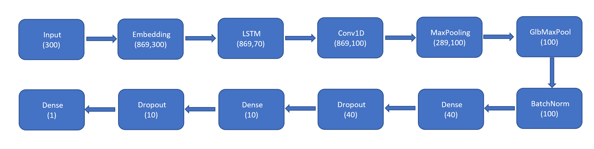
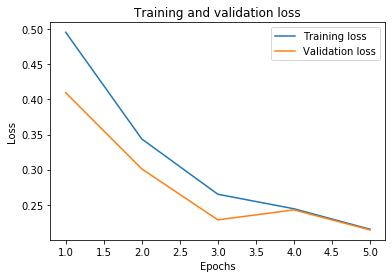
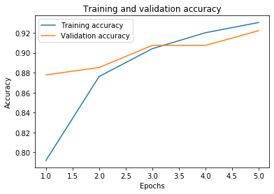
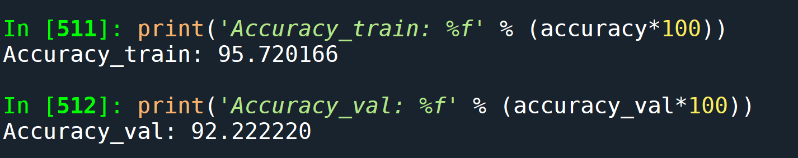

# LSTM_ToxicComment_Classification
  Natural Language Processing
  
 <Note!>: This document contains examples of profaine language that includes "toxic" words.

This topic refers to classify the comments such as in forums which some times may be abusive or insulting and we call them "toxic comments".
By identifing and filtering the negative conversations we can build a model which could make prediction to classify the comments either being "toxic" or "non-toxic" such as the below comments:

***1) toxic comment - 1 - "Stupid piece of shit stop deleting my stuff asshole go die and fall in a hole go to hell! "***

***2) non-toxic comment - 0 - "They are NOT original research, they are pointed in the episodes."***

The training data was taken from [Kaggle](https://www.kaggle.com/c/jigsaw-multilingual-toxic-comment-classification/data) and was split into 80% of the data for training, 10% for test and 10% for validation.

# Dataset

Before training and evaluating the model we need to:
   - Prepare the data
   - Implement the LSTM (RNN) model

As the current data from the file cannot be directly fed into the network we :
1) first pre-processed it by removing the punctuation, stop-words,lowercasing and stemming words (such as reverted->revert);
2) split data only for 'toxic comment' and its label;
3) converted text data into token vector, fit on text, converted into a list of integers, mapped the indexes to words and found the maximum length for padding;
4) split data into 80% training, 10% validation and 10% testing;
5) created a new embedding dictionary based on wiki.en.vec and built up the embedding matrix for out model;
6) added the LSTM model:

7) compiled and train the model

# Results
We can see that the model prediction is good, resulting in low loss or sum of the errors made for each example in both, training and validation by resulting a ***train accuracy of 95.72% and a validation accuracy of 92.22%***.

Loss on train and validation

Accuracy on train and validation

Final accuracy

# Conclusion
Working with LSTM RNN models with word embedding initializations, toxic comments can be classified from the clean comments and for boosting the accuracy we need to make sure that we generate accurate predictions on the training set.

This work was conducted by:
Cristina Manoila
Alexe Ciurea
 
